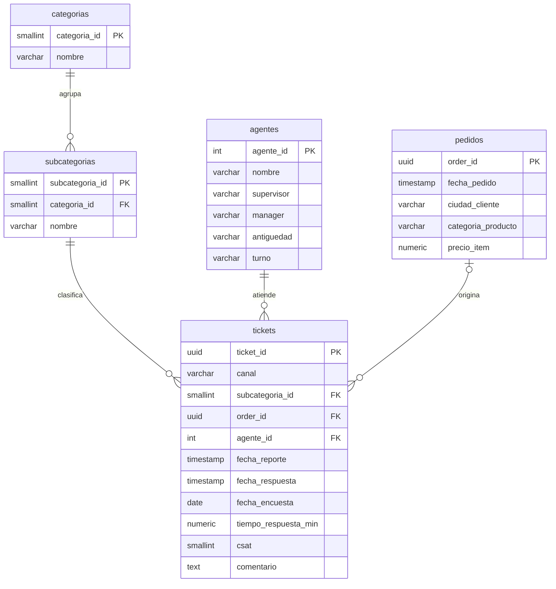

# Capstone Project: Análisis de Calidad de Soporte (PostgreSQL)

Análisis exploratorio de datos (EDA) sobre **85.907 tickets de soporte** de un e-commerce. El objetivo principal de este proyecto es identificar los quiebres en la satisfacción del cliente (CSAT) y proponer mejoras operativas y de negocio basadas en datos.

## 1. Contexto de Negocio

El área de soporte gestiona interacciones a través de tres canales (Inbound, Outcall y Email). Tras cada contacto, el cliente califica la atención de 1 a 5 (CSAT). El análisis busca responder las siguientes preguntas clave:

1. ¿Qué motivos de contacto concentran el volumen y cuáles generan mayor fricción?
2. ¿Cuál es el impacto del tiempo de respuesta (SLA) en el CSAT?
3. ¿Existe variación de rendimiento según el canal o la etapa de maduración/antigüedad del agente?
4. ¿Qué impacto económico (ventas, ciudades, productos) está asociado a los tickets reportados?

> **Métricas:** Satisfecho (CSAT 4-5) | Insatisfecho (CSAT 1-2). Las métricas de "ventas" o "gasto" calculadas en este proyecto consideran únicamente el valor de los pedidos que derivaron en la apertura de un ticket.

## 2. Dataset y Limitaciones

- **Origen:** `Customer_support_data.csv` (85.907 filas × 20 columnas). Rango temporal: 28/07/2023 - 31/08/2023.
- **Modelo de datos:** El dataset carece de un maestro de clientes y un catálogo de productos con IDs únicos. Para solventar esto, la segmentación de clientes se aproximó utilizando la dimensión geográfica (`ciudad`), y el análisis de catálogo mediante la `categoría de producto`.
- **Integridad:** Las variables de negocio (precio, ciudad, categoría) presentan una alta tasa natural de valores ausentes (aprox. 80%), correspondientes a consultas generales que no involucraron una transacción específica.

## 3. Modelo Físico Normalizado

Se implementó un modelo relacional (esquema copo de nieve) para optimizar las consultas y reducir la redundancia, pasando de un archivo plano a una estructura robusta en base de datos.



## 4. Estructura del Repositorio y Ejecución

**Requisitos:** PostgreSQL 12+, `psql` o cliente compatible (DBeaver, pgAdmin).

```text
.
├── estructura.sql          # DDL, ingesta, ETL y QA
├── analisis.sql            # Bloques de consulta respondiendo al problema de negocio
├── README.md
└── data/
    └── Customer_support_data.csv
```

1. **Crear la base de datos:**
   ```sql
   CREATE DATABASE capstone_project;
   ```
2. **Ejecutar modelo lógico:** Conectarse a la base creada y ejecutar `estructura.sql` para generar las tablas.
3. **Ingesta de datos crudos:**
   ```bash
   \copy stg_soporte FROM 'data/Customer_support_data.csv' WITH (FORMAT csv, HEADER true, ENCODING 'UTF8')
   ```
4. **ETL y Poblado:** Ejecutar nuevamente `estructura.sql`. Este script transforma los datos de la tabla de staging y los inserta en el modelo normalizado.
5. **Análisis:** Ejecutar los bloques de `analisis.sql`.

## 5. Tratamiento y Limpieza de Datos (ETL)

Previo al análisis, se aplicaron reglas de calidad de datos en la etapa de Staging:
* **Manejo de Nulos:** Los datos ausentes en campos críticos (precio, ciudad) se mantuvieron explícitamente como `NULL` para no distorsionar distribuciones ni alterar promedios, tratándolos con `COALESCE` solo a nivel de visualización en las consultas analíticas.
* **Formatos de Fecha:** Estandarización de nomenclaturas mixtas (`DD/MM/YYYY HH24:MI` y `DD-Mon-YY`) mediante casteo explícito a `TIMESTAMP` y `DATE`.
* **Exclusión de anomalías:** 3.128 tickets presentaban timestamps donde la respuesta era anterior al reporte. Se sanitizaron configurando el tiempo de respuesta como nulo para no sesgar la métrica del SLA.
* **Sanitización:** Uso de `INITCAP` y `TRIM` para unificar strings, y sentencias `UPDATE` para corregir errores de tipeo de origen (ej. `Home Appliences`).

## 6. Hallazgos del Análisis

**Línea base:** El CSAT general promedia **4,24 / 5**, con un **82,5%** de clientes satisfechos y **14,6%** insatisfechos. La mediana de tiempo de respuesta general es de 6 minutos. 

**1. Fricción focalizada en procesos operativos, no en consultas generales**
*Returns* (51,3%) y *Order Related* (27,0%) concentran el 78% de la demanda. Mientras que las devoluciones mantienen una insatisfacción controlada (12,2%), los problemas vinculados a *Order Related* superan el promedio llegando al 17,9%. La categoría crítica es *Cancellation*, que por sí sola tracciona un **21,5% de insatisfacción**.

**2. El impacto crítico del SLA en la experiencia**
Existe una correlación directa entre la demora y la degradación del servicio. Las resoluciones rápidas (< 5 min) logran apenas un 8,9% de insatisfacción. Sin embargo, al cruzar la barrera de las 4 horas de espera, la tasa de insatisfacción se triplica, alcanzando el **27,7%**. Actualmente, el 12,9% del backlog total cae en este segmento de riesgo.

**3. La raíz del problema es logística, no de atención al cliente**
Al desglosar a nivel subcategoría, se observa que los puntos de mayor dolor son incontrolables por el agente en línea: *Technician Visit* (33,6% de insatisfacción) y *Seller Cancelled Order* (30,4%). El equipo de soporte está absorbiendo el castigo en el CSAT causado por fallas en la última milla logística y cancelaciones de vendedores de la plataforma.

**4. Curva de aprendizaje y carga operativa**
El 38% del pool de agentes se encuentra tipificado como *On Job Training*. Este grupo está gestionando casi el **30% de los tickets totales** y presenta la calificación más baja del centro de contacto (4,15 de CSAT promedio). Existe una deficiencia en el ruteo de tickets complejos hacia perfiles junior.

**5. Desempeño del Canal Email**
El canal Email presenta las peores métricas de todo el ecosistema de atención, promediando un CSAT de **3,90** y un 23,2% de insatisfacción (vs ~14% en canales de voz). Aunque procesa menor volumen, representa un punto ciego de calidad.

**6. Distribución del valor económico**
El gasto está sumamente fragmentado geográficamente (las principales 5 ciudades concentran apenas el 20,3% del gasto detectado). En contraste, a nivel producto hay alta concentración: la categoría *Mobile* retiene el **42% de los ingresos monetarios** impactados por tickets, seguida de lejos por *Furniture*, cuyo volumen de tickets es bajo (471) pero arrastra un alto valor económico promedio por incidente.

## 7. Recomendaciones Estratégicas

1. **Gestión de SLAs y Alertas:** Implementar triggers de escalamiento automático para cualquier ticket de alto valor que supere los 30 minutos sin respuesta de primera línea.
2. **Re-enrutamiento de Casos Críticos (Skill-based routing):** Restringir el ruteo de tickets de *Technician Visit* y *Seller Cancelled Order* a agentes en status *On Job Training*. Estos motivos requieren perfiles senior con herramientas de compensación o contacto directo con logística.
3. **Auditoría de Calidad Asíncrona:** Iniciar una revisión de calidad sobre los macros y plantillas utilizadas en el canal Email, evaluando si el tono, la precisión o la falta de resolución en el primer contacto (FCR) están desplomando el CSAT.
4. **Mejora Logística:** Integrar los hallazgos de fallos en visitas técnicas como un KPI operativo para el área de supply chain, dado que impactan directamente el LTV del cliente a través del soporte.
