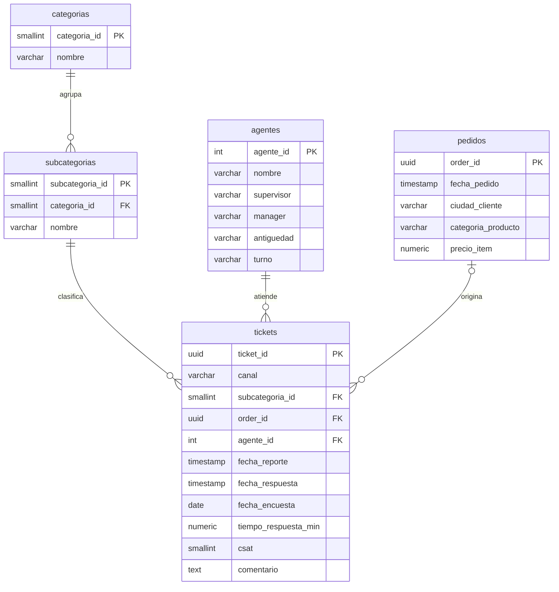

# Capstone SQL · Calidad del soporte al cliente en un e-commerce (PostgreSQL)

Análisis exploratorio de datos (EDA) sobre **85.907 tickets de soporte** de un e-commerce, con el objetivo de entender **dónde se pierde satisfacción del cliente (CSAT)** y qué palancas operativas conviene priorizar.

## 1. Problema de negocio

El área de soporte atiende contactos por tres canales (Inbound, Outcall y Email) y, después de cada contacto, el cliente puntúa la atención de 1 a 5 (CSAT). La dirección necesita responder:

1. ¿Qué motivos de contacto concentran el volumen y cuáles generan más insatisfacción?
2. ¿Cuánto influye la **velocidad de respuesta** en la satisfacción?
3. ¿Rinden distinto los agentes según su **antigüedad** o el **canal** de contacto?
4. ¿Qué **productos, ciudades y montos** están detrás de los pedidos que llegan a soporte?

> Definiciones usadas: **satisfecho** = CSAT 4 o 5 · **insatisfecho** = CSAT 1 o 2 · **ventas** = precio de los pedidos *que generaron un ticket* (no son las ventas totales de la empresa).

## 2. Dataset

- **Archivo:** `Customer_support_data.csv` (85.907 filas × 20 columnas). Un ticket por fila, entre el 28/07/2023 y el 31/08/2023.
- **Campos clave:** canal, categoría y subcategoría del contacto, fechas de reporte/respuesta, CSAT, agente (con supervisor, manager, antigüedad y turno) y, cuando existe, datos del pedido (fecha, ciudad, categoría de producto y precio).
- **Limitaciones de origen:**
  - Precio, fecha de pedido, ciudad y categoría de producto **faltan en ~80 % de los tickets** (los contactos sin pedido asociado son otro 21 %).
  - **No hay ID de cliente ni catálogo de productos.** La consigna sugiere tablas `clientes`, `pedidos` y `productos`; acá el "cliente" se aproxima con la **ciudad** y el "producto" con la **categoría de producto**.
  - La moneda no está indicada (las ciudades son de India, probablemente INR).

### Cómo se cubren las consultas sugeridas por la consigna

| Sugerida | Versión adaptada a este dataset | Consulta |
|---|---|---|
| Top 5 clientes por gasto (GROUP BY + SUM) | Top 5 **ciudades** por gasto | 2 |
| Ventas totales por mes (funciones de fecha) | Ventas por mes de **compra** del pedido | 1 |
| 3 productos menos vendidos | 3 **categorías de producto** menos vendidas | 3 |
| Ranking de pedidos por categoría con RANK() | Ranking de pedidos por **categoría de producto** | 4 |

Además se agregaron 5 consultas propias sobre la experiencia del cliente (consultas 5 a 9).

## 3. Modelo de datos

El CSV es una "hoja gigante" de 20 columnas con mucha redundancia. Se normalizó en 5 tablas (más una tabla `stg_soporte` con los datos crudos, que se conserva para poder auditar la limpieza).



## 4. Cómo ejecutar el código

**Requisitos:** PostgreSQL 12 o superior, y `psql` o pgAdmin 4.

```
.
├── estructura.sql          # tablas, carga y limpieza
├── analisis.sql            # calidad de datos + 9 consultas comentadas
├── README.md
└── data/
    └── Customer_support_data.csv
```

1. **Crear la base** (conectado a `postgres`):
   ```sql
   CREATE DATABASE capstone_project;
   ```
2. **Crear las tablas**: conectate a `capstone_project` y ejecutá `estructura.sql`. La primera vez crea todo y termina con conteos en 0 (todavía no hay datos).
3. **Cargar el CSV** en `stg_soporte` (elegí una opción):
   - *psql*, desde la raíz del repo (en una sola línea):
     ```
     \copy stg_soporte FROM 'data/Customer_support_data.csv' WITH (FORMAT csv, HEADER true, ENCODING 'UTF8')
     ```
   - *pgAdmin 4*: clic derecho sobre `stg_soporte` → Import/Export Data → Import · Format `csv` · Header `Yes` · Delimiter `,`.
4. **Volver a ejecutar `estructura.sql`**: ahora limpia los datos y puebla las tablas. Verificá los conteos finales:

   | tabla | filas esperadas |
   |---|---|
   | stg_soporte | 85.907 |
   | categorias | 12 |
   | subcategorias | 59 |
   | agentes | 1.371 |
   | pedidos | 67.675 |
   | tickets | 85.907 |

5. **Ejecutar `analisis.sql`** completo o consulta por consulta. Cada consulta tiene arriba el *porqué* de sus decisiones y abajo una **LECTURA** con la interpretación.

## 5. Limpieza de datos (resumen)

| Problema detectado | Qué se hizo y por qué |
|---|---|
| Precio, fecha, ciudad y categoría de producto nulos en ~80 % | **No se rellenan con 0 ni con fechas inventadas**: un NULL es "desconocido" y un 0 sesgaría promedios. Se excluyen del cálculo y se cuantifican (consulta A1). `COALESCE` se usa para etiquetas (`'Sin dato'`) y totales (`COALESCE(SUM(...), 0)`). |
| Fechas en dos formatos (`DD/MM/YYYY HH24:MI` y `DD-Mon-YY`) guardadas como texto | Conversión con formato explícito a `TIMESTAMP` y `DATE`, para que `01/08/2023` se lea como 1 de agosto y no como 8 de enero. |
| 3.128 tickets con respuesta **anterior** al reporte | El tiempo de respuesta se anula (NULL) en vez de promediar valores negativos; se conservan las fechas originales. |
| 58 pedidos fechados **después** del ticket | Se excluyen de la serie mensual de ventas. |
| 1 pedido con precio 0 | Se convierte a NULL (un precio 0 no es una venta). |
| Ciudades en MAYÚSCULAS y categoría con error de tipeo (`Home Appliences`) | `INITCAP`, `TRIM` y un `UPDATE` de normalización. |
| Columna `connected_handling_time` 99,7 % vacía y sin unidad documentada | Se conserva pero se descarta del análisis. |

Además, los tipos de datos se verifican en la consulta A3 (`TIMESTAMP`/`DATE` para fechas y `NUMERIC` para montos), y `tickets` debe terminar con las mismas 85.907 filas que la tabla de staging, lo que confirma que los JOIN de la carga no duplican ni pierden registros.

## 6. Hallazgos principales

**Línea base:** CSAT promedio **4,24 / 5**; **82,5 %** de clientes satisfechos y **14,6 %** insatisfechos. La mediana de respuesta es de **6 minutos**: la operación es rápida en general, y los problemas están en casos puntuales.

### 1. El soporte es, sobre todo, devoluciones y pedidos
*Returns* (51,3 %) y *Order Related* (27,0 %) suman el **78 %** del volumen y ~81 % del dinero en juego (~49 M en *Order Related* y ~30 M en *Returns*, sobre pedidos con precio informado). *Returns* se gestiona bien (12,2 % de insatisfechos), pero *Order Related* llega a **17,9 %**, por encima del promedio. La mayor tasa de insatisfacción está en *Cancellation* (**21,5 %**, 2.212 tickets). *(Consulta 5)*

### 2. La velocidad de respuesta es la palanca operativa más clara
La satisfacción cae en escalera con la espera: hasta 5 minutos → CSAT **4,48** y **8,9 %** de insatisfechos; más de 4 horas → CSAT **3,71** y **27,7 %** (más del triple). El **12,9 %** de los tickets con tiempo válido (10.660) espera más de 4 horas. *(Consulta 7)*
**Qué significa:** como la mediana es de 6 minutos, acelerar los casos rápidos rinde poco; conviene atacar la "cola" lenta (alertas de SLA a los 30 minutos, derivación a supervisores). Es una asociación, no prueba causalidad: los casos complejos también tardan más.

### 3. Los focos más dolorosos son fallos de cumplimiento, no de atención
Dentro de las subcategorías (mínimo 200 tickets): *Returns / Technician Visit* (**33,6 %** insatisfechos) y *Order Related / Seller Cancelled Order* (**30,4 %**). Por volumen pesa *Order Related / Delayed*: 7.388 tickets con 19,8 % de insatisfechos. En cambio, el trámite estándar *Return request* (8.523 tickets) tiene solo 5,5 %. *(Consulta 6)*
**Qué significa:** ningún agente puede compensar que el técnico no llegue o que el vendedor cancele; el problema está en logística y en el seguimiento de vendedores, y se resuelve ahí.

### 4. Los agentes en entrenamiento concentran una parte grande del problema
Los agentes *On Job Training* son 518 de 1.371 (38 %), atienden el **29,7 %** de los tickets y tienen la peor satisfacción (CSAT **4,15**, **16,6 %** insatisfechos, contra 12,2 % a 14,1 % del resto). La antigüedad no mejora de forma lineal: los de más de 90 días (4,27) no superan a los de 31-60 (4,30). *(Consulta 8)*
**Qué significa:** derivar o acompañar a los agentes en entrenamiento en los motivos críticos del hallazgo 3, en lugar de repartir todo por igual.

### 5. Email es el canal más débil
CSAT **3,90** y **23,2 %** de insatisfechos, contra ~14 % en Inbound y Outcall, aunque aporta solo el 3,5 % del volumen. Parte de la brecha puede deberse a que en Email pesan más los reclamos complejos (*Refund Related* y *Order Related*), pero la mediana de respuesta (7 min) no la explica sola: conviene revisar la calidad de las respuestas escritas. *(Consulta 9)*

### 6. El valor está concentrado por producto, no por ciudad
- **Mobile** es ~10 % de los pedidos y **~42 %** de las ventas. Las tres categorías menos vendidas son *GiftCard* (26 pedidos), *Affiliates* (166) y *Furniture* (471): "menos vendido" no es "menos importante", porque *Furniture* factura ~4 M por su ticket alto (~8.500) y *Affiliates* casi nada (~214). *(Consulta 3)*
- Por ciudad, las 5 principales (Hyderabad, New Delhi, Mumbai, Pune y Bangalore) suman solo **20,3 %** del gasto entre 1.782 ciudades: no hay una plaza dominante. Y en esas 5 ciudades el CSAT (3,60 a 3,85) está **por debajo del promedio general**: los clientes con pedidos valorizados que contactan a soporte están menos conformes. *(Consulta 2)*
- Los pedidos más caros de cada categoría llegan por los mismos motivos que el resto (72 % por *Returns* u *Order Related*): hacen falta más controles sobre esos motivos, no un proceso aparte. *(Consulta 4)*

### 7. Cuidado con la serie mensual de ventas
Julio y agosto de 2023 concentran casi el **95 %** de los pedidos con ticket, pero **no es crecimiento**: los tickets se abrieron entre el 28/07 y el 31/08 y los clientes reclaman por compras recientes. Lo útil es otra lectura: la demanda de soporte sigue a las ventas de las últimas 4 a 6 semanas, y el equipo debería dimensionarse con ese horizonte. *(Consulta 1)*

## 7. Recomendaciones

1. **Alertas de SLA** para cualquier ticket sin respuesta a los 30 minutos (hallazgo 2).
2. **Atacar la causa raíz logística** de *Technician Visit*, *Seller Cancelled Order* y *Delayed* (hallazgo 3).
3. **Acompañar a los agentes en entrenamiento** y derivar los motivos críticos a agentes con más de 30 días (hallazgo 4).
4. **Auditar la calidad de las respuestas por Email** (hallazgo 5).
5. **Capturar precio, fecha y categoría del pedido en todos los tickets**: hoy falta en ~80 %, lo que impide medir el impacto económico real del soporte.

## 8. Limitaciones

- Las conclusiones sobre ventas describen solo los pedidos que **generaron un ticket** (~20 % de la base con precio informado); no son representativas de las ventas totales.
- El período es de ~5 semanas: no permite analizar estacionalidad.
- Los hallazgos muestran **asociaciones**, no causalidad.
- Se asume que el nombre del agente lo identifica de forma única (1.371 nombres).

## 9. Técnicas de SQL usadas

`CREATE TABLE` con PK/FK/`CHECK`/`IDENTITY` · `COPY` desde CSV · `INSERT … SELECT` · `UPDATE` · `JOIN` (INNER y LEFT) sobre hasta 4 tablas · `GROUP BY` + `HAVING` · `COALESCE`, `NULLIF`, `CASE` · CTE (`WITH`) · funciones de ventana (`RANK`, `LAG`, `SUM() OVER`) · funciones de fecha (`DATE_TRUNC`, `TO_TIMESTAMP`, `TO_DATE`, `EXTRACT`) · `PERCENTILE_CONT` · índices solo en columnas de JOIN/filtro.
